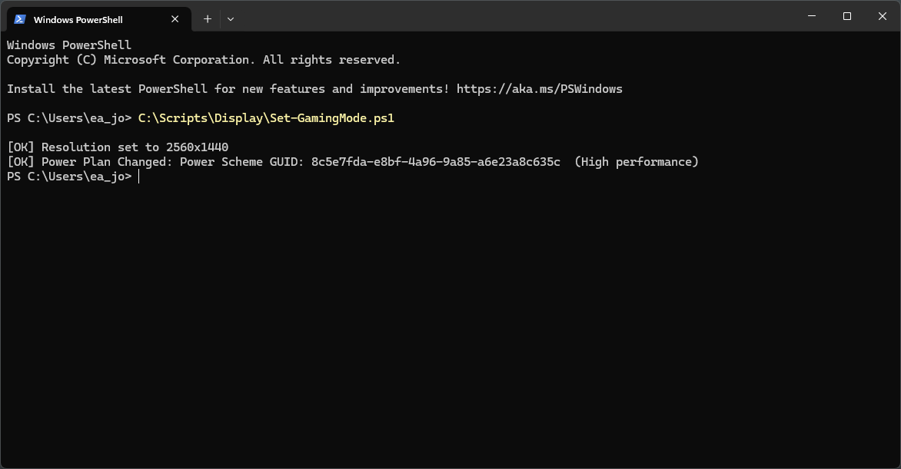
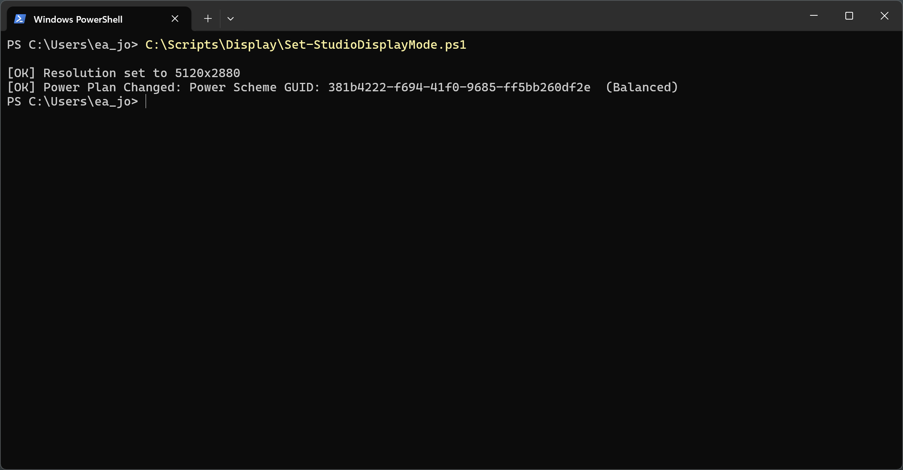
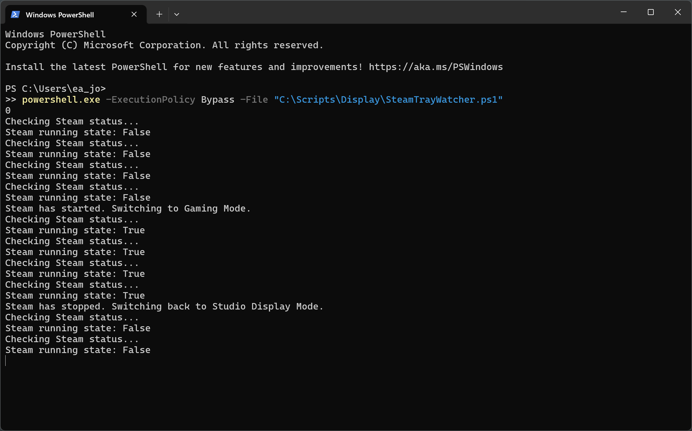
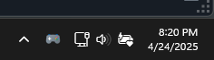
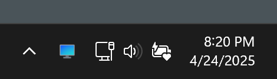

# Steam Display Switcher 

## Why I Made This

Switching my display resolution and power plan every time I wanted to play _Hogwarts Legacy_ was starting to get annoying. My Dell XPS runs the game way smoother at 1440p than the full 5K resolution of my Studio Display, but manually tweaking settings every session felt like unnecessary friction. So I created a small system to automate the whole thing.
## What It Does

This setup toggles my display mode and power profile when Steam launches and reverts them when it closes with a tray icon to visually confirm the mode I'm in. It started as two PowerShell scripts, evolved into batch files for convenience, and now lives inside a watcher script that tracks the Steam process in real time.

## Scripts Overview

### `Set-GamingMode.ps1` / `Set-GamingMode.bat`

- Changes the display resolution to 2560x1440.
- Switches to the "High performance" power plan.
- Intended for gaming sessions.
- The `.bat` file is just a wrapper so I can double-click it or call it from other scripts without needing to invoke PowerShell directly.



### `Set-StudioDisplayMode.ps1` / `Set-StudioDisplayMode.bat`

- Reverts the display resolution to 5120x2880 (Studio Display native).
- Switches back to the "Balanced" power plan.
- Again, the `.bat` file is just a wrapper so I can double-click it or call it from other scripts without needing to invoke PowerShell directly.



### `SteamTrayWatcher.ps1`

This ties both `.bat` scripts together and adds a system tray icon in the taskbar to show which display resolution and power plan mode is currently active:
- Runs in the background and checks every 5 seconds whether Steam is running.
- When Steam opens, it runs `Set-GamingMode.bat` and updates the system tray icon to a game controller.
- When Steam closes, it waits a few seconds (to ensure Steam really shut down) and then runs `Set-StudioDisplayMode.bat`, changing the icon back to a monitor.

The tray icon gives me visual feedback about the current mode without needing to open Task Manager or guess if the scripts actually ran.


^ _Script output that is hidden in the background._



^ _System tray icon of Gaming Mode_



^ _System tray icon of Studio Display Mode_

### `SteamTrayWatcherLauncher.ps1`

The `SteamTrayWatcherLauncher.ps1` script is a wrapper for launching the `SteamTrayWatcher.ps1` script that I set to run at system startup. 

1. **Hides the PowerShell Window**: Runs the watcher script in the background without displaying a PowerShell window.
2. **Bypasses Execution Policy**: Temporarily bypasses the system's execution policy to allow the script to run without modifying global settings.


## Next Steps

After getting my software setup working well, I started thinking about the physical hardware I already have: a Raspberry Pi, LEDs, buttons, resistors, and a breadboard - all just collecting dust from previous classes. Why not put them to use?

I landed on building my own version of a [Stream Deck](https://www.elgato.com/us/en/p/stream-deck-mk2-black) - a hardware device with physical buttons mapped to shortcuts, rather than buying one since I already have the components.

Though I initially planned to use the Raspberry Pi, I got sidetracked exploring embedded systems and decided to use an [Arduino](https://www.arduino.cc/maker) instead. The Arduino is essentially a board built around a microcontroller chip that lets me write code that talks directly to hardware. Unlike my Raspberry Pi which runs a full Linux operating system with all its layers of abstraction, Arduino code runs directly on the hardware. This direct hardware access makes it perfect for projects where timing really matters, like precisely controlling motors or reading sensors.

For this simple project, either would work fine, but I'm excited to learn how this closer to the hardware approach works. Microcontrollers like the one on the Arduino board are what power most of the critical embedded systems around us where reliability matters - they have fewer components that can fail, more predictable execution timing, and they're designed for specific tasks rather than trying to be a jack of all trades like the Raspberry Pi.

What's fascinating me about embedded systems is how ubiquitous they are - these microcontrollers are everywhere but mostly invisible to us. They're in household appliances like washing machines and thermostats, critical systems like car engine control units and pacemakers, and infrastructure components like parking meters and traffic lights. These tiny systems operate with minimal resources compared to single board computers, often running for years on battery power, fitting into small spaces, and responding instantly to inputs. 

All that being said, here's my implementation plan for incorporating hardware with the PowerShell scripts:

- [x] Connect buttons to an Arduino board
- [x] Program Arduino to communicate button presses to the Raspberry Pi via serial connection
- [x] Keep the Raspberry Pi running as a local web server my XPS can communicate with
- [x] Have the Raspberry Pi relay the Arduino's button press events to my XPS via web connection
- [x] When button press is detected, launch Steam to trigger my existing PowerShell scripts

## Putting It All Together

### `button-press-arduino.ino`

This Arduino script detects when a button is pressed, using a software debounce method to filter out electrical noise and rapid mechanical fluctuations that could cause multiple false triggers. The sketch uses INPUT_PULLUP mode and prints "BUTTON_PRESSED" to the serial monitor only when a stable, confirmed press is detected.

**What Is Debouncing?**

When a mechanical button is pressed or released, the signal doesn't switch cleanly between HIGH and LOW. Instead, it can "bounce", rapidly fluctuating between states for a few milliseconds due to physical vibrations and contact inconsistencies.

Without debouncing, a single press might register as multiple inputs. Software debouncing solves this by:

- Tracking when the state first changes.
- Waiting a fixed amount of time (the debounce delay) to see if the input stays stable.
- Confirming the change only if the signal remains consistent during that window.

#### Setup and Initialization
```
const int buttonPin = 12; 
unsigned long lastDebounceTime = 0;
unsigned long debounceDelay = 1000;  // 1 second debounce period
int lastButtonState = HIGH;
int buttonState = HIGH;

void setup() {
  Serial.begin(9600);
  pinMode(buttonPin, INPUT_PULLUP);
  Serial.println("Button detection ready...");
}
```
`buttonPin`: the input pin connected to the button (pin 12).

`INPUT_PULLUP`: configures the pin to use the internal pull-up resistor. The button reads HIGH by default, and goes LOW when pressed.

`lastDebounceTime`: remembers the time when a potential change was first seen.

`debounceDelay`: how long the state must remain stable before confirming it (1000 ms = 1 second).

`lastButtonState`: the state from the previous loop iteration (used to detect changes).

`buttonState`: the confirmed, stable state of the button.

`Serial.begin(9600)`: starts serial communication for monitoring.

`Serial.println("Button detection ready...")`: signals that the system is active.

#### Main Loop: Debounced Button Press Detection
```
void loop() {
  // Read the current button state
  int reading = digitalRead(buttonPin);
```
- Captures the raw input signal from the button.
- May be noisy if the button is bouncing.

##### Step 1: Detect a Change in Raw Input
```
  if (reading != lastButtonState) {
    lastDebounceTime = millis(); // Reset debounce timer
  }
```

- If the new reading is different from the last loop's reading, the button might have been pressed or released.
- Instead of acting immediately, the sketch resets the debounce timer (`lastDebounceTime`) to mark the moment this change began.
- This delay acts as a buffer to wait and see if the change is real or just a bounce.

##### Step 2: Check if the Signal Has Stabilized
```
  if ((millis() - lastDebounceTime) > debounceDelay) {
```
- Waits to see if enough time has passed since the last detected change.
- `millis()` returns the number of milliseconds since the program started.
- If more than `debounceDelay` (1000 ms) has passed, the input is assumed stable and worth checking.

##### Step 3: Confirm the New Stable State
```
    if (reading != buttonState) {
      buttonState = reading;
```
- If the stabilized reading still differs from the current `buttonState`, a legitimate change has occurred.
- `buttonState` is updated to match the newly confirmed state.

##### Step 4: Respond to the Button Press
```
      if (buttonState == LOW) {
        Serial.println("BUTTON_PRESSED");
      }
    }
  }
```
- Since the script uses `INPUT_PULLUP`, a `LOW` state means the button is pressed.
- When confirmed, it prints "BUTTON_PRESSED" to the serial monitor.

##### Step 5: Update for the Next Loop
```
  lastButtonState = reading;
}
```
- At the end of each loop, `lastButtonState` is updated to hold the most recent raw reading.
- This allows the script to detect changes in the next iteration.

## `flask_button_server.py`
This Python script creates a Flask web server that communicates with an Arduino over serial to detect button presses. When a press is detected, the front-end interface updates live, providing simple real-time monitoring.

**Overview**
- The Arduino sends `"BUTTON_PRESSED"` via USB serial when a button is pressed.
- This script reads the serial data and serves a webpage that:
    - Displays the current status of the button.
    - Auto-refreshes when a press is detected.
- It uses a long-polling route (`/wait_for_press`) that holds the request open for up to 30 seconds while waiting for input.
- The interface is updated using `fetch()` in JavaScript.

### Dependencies
```
import serial
import time
from flask import Flask, Response
```
- `serial (via pyserial)`: Communicates with the Arduino.
- `time`: For timeouts and sleeping during polling loops.
- `Flask`: A web framework to serve HTML and respond to button status requests.

### Arduino Serial Initialization
```
app = Flask(__name__)

try:
    ser = serial.Serial('/dev/ttyACM0', 9600, timeout=1)
    print("Connected to Arduino!")
except serial.SerialException as e:
    print(f"Error connecting to Arduino: {e}")
    print("Server will run, but button detection won't work")
    ser = None
```
- The script attempts to connect to the Arduino on `/dev/ttyACM0`.
- If the connection fails (Arduino not plugged in), `ser` is set to `None`, and the script continues running with limited functionality.
- `timeout=1` ensures that serial reads don’t block forever.

### `/` Route - Main Web Interface
```
@app.route('/')
def home():
    return """ <!DOCTYPE html> ... """
```

#### HTML/CSS/JavaScript
- HTML: Displays a title and a status message (`<div id="status">`).
- CSS: Applies styles to show `waiting` or `pressed` states with color and emphasis.
- JavaScript:
- The `checkButtonPress()` function uses `fetch('/wait_for_press')` to contact the server.
- If `"PRESSED"` is received, the message updates and the page refreshes after 1 second.
- If an error occurs (e.g. server not responding), it retries after 2 seconds.

### `/wait_for_press` - Long Polling
```
@app.route('/wait_for_press')
def wait_for_press():
    timeout = time.time() + 30  
    
    while time.time() < timeout:
        if ser is None:
            return "ERROR: Arduino not connected"
            
        if ser.in_waiting > 0:
            line = ser.readline().decode('utf-8').rstrip()
            if line == "BUTTON_PRESSED":
                return "PRESSED"
        
        time.sleep(0.1)
    
    return "TIMEOUT"
```
This route is designed to hold the request open until one of three things happens:

1. Valid press:
    - It reads from the serial buffer line-by-line.
    - If `"BUTTON_PRESSED"` is detected, it returns `"PRESSED"`.
2. Timeout:
    - If 30 seconds pass without any valid press, it returns `"TIMEOUT"`.
3. Arduino not connected:
    - If `ser` is `None`, the function returns an error message immediately.

The `time.sleep(0.1)` call prevents the loop from maxing out CPU usage (since it will run as fast as the CPU allows) by adding a small delay in each cycle.

### `/button_status` - Immediate Button Check
```
@app.route('/button_status')
def button_status():
    if ser is None:
        return "ERROR: Arduino not connected"
        
    if ser.in_waiting > 0:
        line = ser.readline().decode('utf-8').rstrip()
        if line == "BUTTON_PRESSED":
            return "PRESSED"
    
    return "NOT_PRESSED"
```
- This endpoint provides an immediate status check.

### Running the Flask Server
```
if __name__ == '__main__':
    print("Starting button server on http://0.0.0.0:5000")
    app.run(host='0.0.0.0', port=5000, threaded=True)
```
- Starts the Flask server and makes it accessible on all network interfaces at port 5000.
- `threaded=True` allows concurrent handling of multiple client requests (needed for long-polling)

## `SteamButtonLauncher.ps1`
This script monitors button presses from a Raspberry Pi-based Flask server and toggles the Steam client on a Windows machine. If Steam is running, it closes it; if it’s not, it launches it.

- A Raspberry Pi running a Flask server reports button states at the `/button_status` endpoint.
- This PowerShell script sends an HTTP request every second to that endpoint.
- If it receives `"PRESSED"` from the server, it:
    - Launches Steam if it’s not running.
    - Closes Steam if it is running.
- A debounce delay ensures that one press doesn’t trigger multiple actions.

### Configuration Variables
```
$PiServer = "RPI_IP_ADDRESS:5000"
$SteamPath = "C:\Program Files (x86)\Steam\steam.exe"
$SteamIsRunning = $false
```
- `$PiServer`: Replace "RPI_IP_ADDRESS" with the Raspberry Pi's actual IP address. This is the address of the Flask server that's monitoring the button.
- `$SteamPath`: Absolute path to steam.exe. This is the application that will be launched or closed.
- `$SteamIsRunning`: Tracks whether Steam is currently open.

