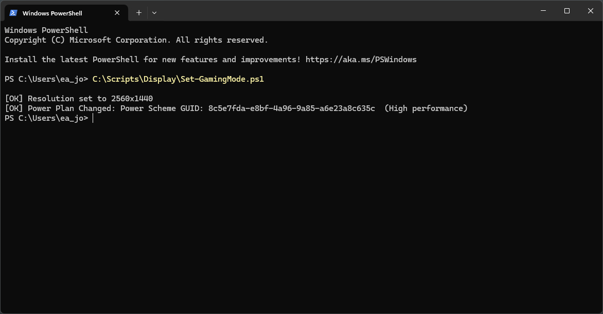
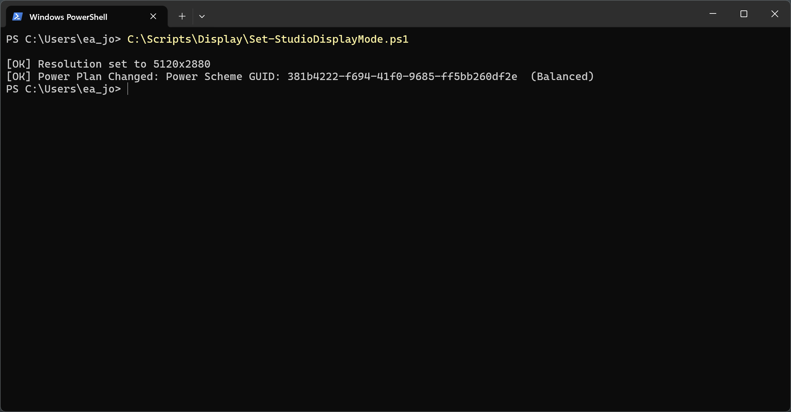
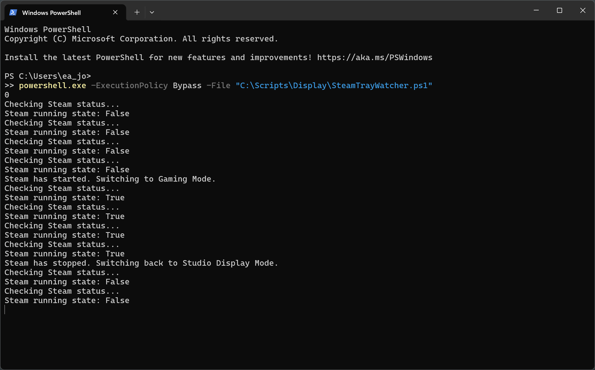
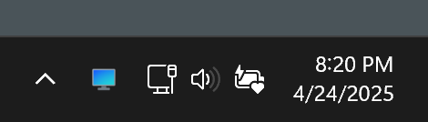

# Steam Display Switcher 

## Why I Made This

Switching my display resolution and power plan every time I wanted to play _Hogwarts Legacy_ was starting to get annoying. My Dell XPS runs the game way smoother at 1440p than the full 5K resolution of my Studio Display, but manually tweaking settings every session felt like unnecessary friction. So I created a small system to automate the whole thing.
## What It Does

This setup toggles my display mode and power profile when Steam launches and reverts them when it closes with a tray icon to visually confirm the mode I'm in. It started as two PowerShell scripts, evolved into batch files for convenience, and now lives inside a watcher script that tracks the Steam process in real time.

## Scripts Overview

### `Set-GamingMode.ps1` / `Set-GamingMode.bat`

- Changes the display resolution to 2560x1440.
- Switches to the "High performance" power plan.
- Intended for gaming sessions.
- The `.bat` file is just a wrapper so I can double-click it or call it from other scripts without needing to invoke PowerShell directly.

### `Set-StudioDisplayMode.ps1` / `Set-StudioDisplayMode.bat`

- Reverts the display resolution to 5120x2880 (Studio Display native).
- Switches back to the "Balanced" power plan.
- Again, the `.bat` file is just a wrapper so I can double-click it or call it from other scripts without needing to invoke PowerShell directly.

### `SteamTrayWatcher.ps1`

This ties both `.bat` scripts together and adds a system tray icon in the taskbar to show which display resolution and power plan mode is currently active:
- Runs in the background and checks every 5 seconds whether Steam is running.
- When Steam opens, it runs `Set-GamingMode.bat` and updates the system tray icon to a game controller.
- When Steam closes, it waits a few seconds (to ensure Steam really shut down) and then runs `Set-StudioDisplayMode.bat`, changing the icon back to a monitor.

The tray icon gives me visual feedback about the current mode without needing to open Task Manager or guess if the scripts actually ran.

^ _Script output that is hidden in the background._

^ _System tray icon of Gaming Mode_

^ _System tray icon of Studio Display Mode_

## Next Steps

After getting my software setup working well, I started thinking about the physical hardware I already have: a Raspberry Pi, LEDs, buttons, resistors, and a breadboard - all just collecting dust from previous classes. Why not put them to use?

I landed on building my own version of a [Stream Deck](https://www.elgato.com/us/en/p/stream-deck-mk2-black) - a hardware device with physical buttons mapped to shortcuts, rather than buying one since I already have the components.

Though I initially planned to use the Raspberry Pi, I got sidetracked exploring embedded systems and decided to use an [Arduino](https://www.arduino.cc/maker) instead. The Arduino is essentially a board built around a microcontroller chip that lets me write code that talks directly to hardware. Unlike my Raspberry Pi which runs a full Linux operating system with all its layers of abstraction, Arduino code runs directly on the hardware. This direct hardware access makes it perfect for projects where timing really matters, like precisely controlling motors or reading sensors.

For this simple project, either would work fine, but I'm excited to learn how this closer to the hardware approach works. Microcontrollers like the one on the Arduino board are what power most of the critical embedded systems around us where reliability matters - they have fewer components that can fail, more predictable execution timing, and they're designed for specific tasks rather than trying to be a jack of all trades like the Raspberry Pi.

What's fascinating me about embedded systems is how ubiquitous they are - these microcontrollers are everywhere but mostly invisible to us. They're in household appliances like washing machines and thermostats, critical systems like car engine control units and pacemakers, and infrastructure components like parking meters and traffic lights. These tiny systems operate with minimal resources compared to single board computers, often running for years on battery power, fitting into small spaces, and responding instantly to inputs. 

All that being said, here's my implementation plan for incorporating hardware with the PowerShell scripts:

- Connect buttons and LEDs to an Arduino board
- Program Arduino to communicate button presses to the Raspberry Pi via serial connection
- Keep the Raspberry Pi running as a local web server my XPS can communicate with
- Have the Raspberry Pi relay the Arduino's button press events to my XPS via web connection
- When button press is detected, launch Steam to trigger my existing PowerShell scripts
- Send status updates back through the Pi to the Arduino to illuminate LEDs